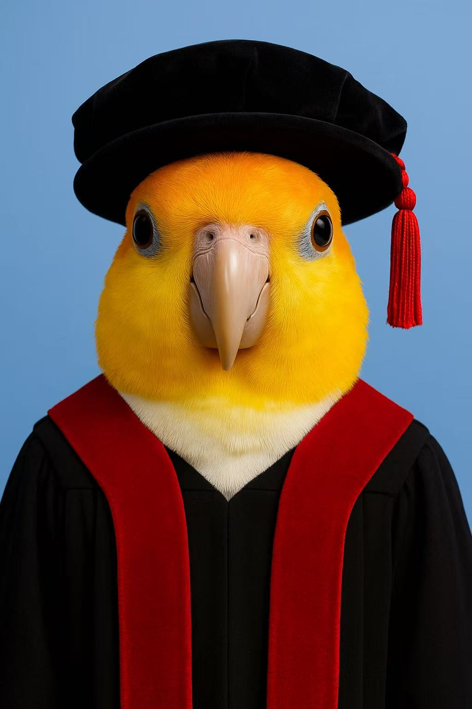
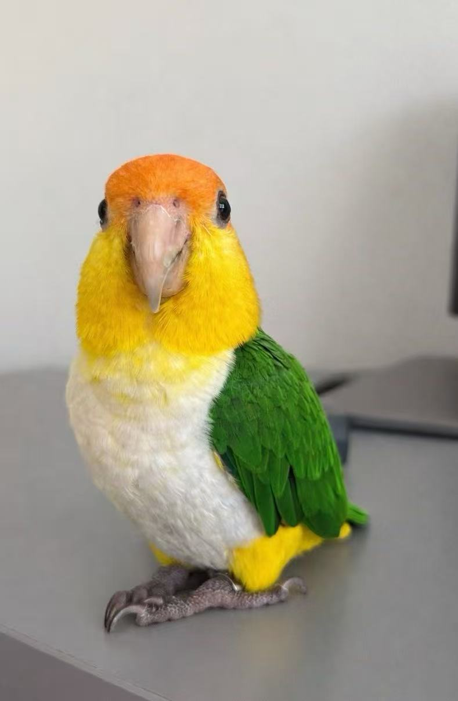

## Non-Human Team Member

  

    
    
  

  
<em>Bubble — a “PhD” caique 🐦, my feathered PI and toughest reviewer. She supervises most of my work from my shoulder, and occasionally performs “robustness testing” by walking on my keyboard and injecting random bugs. </em>

